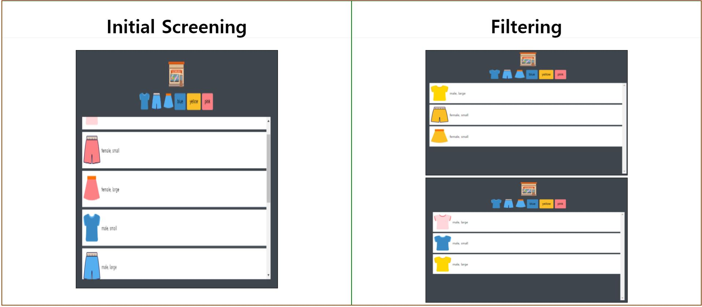

#First application using filter when clicking on button event  
  
###1. Project name : shopping-template game  
  
###2. Technologies stack : HTML, CSS, Javascript  
  
###3. Period : 1 week  
  
###4. Main functions  
  

<!--###5. Architecture diagram-->

###5. Interpreting several codes  
  
`HTML`

- `<!DOCTYPE html>`: Declared HTML version is announced to browser
- `<meta charset="UTF-8" />`: Text encoding method for Unicode
- `<script src="src/main.js" defer>`: Parallel download and then execute after parsing HTML
- `<section class="buttons">`: button icons could be placed on same section in a row instead of veltical axis respectively. in addition, class match between html and css is important for success display

`CSS`

- `display: flex`: The data on container are linded up in a row
  `flex-direction: column`: Place the data on container on vertical axis direction
  `justify-content: center`: Place the data on center of main axis
  `align-items: center`: Place the data on center of opposite axis
- `width: 60%`: Display width size depending on device display size. and height is also possible
- `padding: var(--base-space)`: Block size edge of near comments
  `margin-left: var(--base-space)`: Block size edge of outside

`JSON : javascript object notation`

- `{ "items":[ {},{},{} ] }`: JSON is object. and include items's array. the array include item's object

`javascript`

- `fetch("data/data.json") .then(response => response.json()) .then(json => json.items);`: Fetch the data from the JSON file. if success, fetch items from JSON file.
- `const container = document.querySelector('.items');`: Select the data in "items" class and put in container
  `container.innerHTML = items.map(item => creatHTMLString(item)).join('');`: Mapping the data in container would be display on HTML with string type and console.log is readerable on good condition
- `buttons.addEventListener('click', (event) => onButtonclick(event, items));`: execute event function when clicking button event

-`const dataset = event.target.dataset; const key = dataset.key; const value = dataset.value;`: readable value management

-`const filtered = items.filter(item => item[key] === value); displayItem(filtered);`: execute displayItem function after filtering certain data key, value and connection with html

###6. Resolve failures

- fatal: invalid gitfile format : shopping-template.zip
  fatal: Could not read from remote repository

  - Occurred when put in `git push`
  - Remote name was different. I entered `git push --set-upstream Shopping-template.zip main`
  - Countermeasure: `git push --set-upstream Shopping-template main`

- fatal: refusing to merge unrelated histories

  - Occurred when put in `git pull`
  - Needed to combine with unrelated histories
  - Countermeasure: `git pull origin main --allow-unrelated-histories`

- fatal: 'origin' does not appear to be a git repository
  fatal: Could not read from remote repository

  - Occurred when put in `git pull origin main --alow-unrelated-histories`
  - No origin branch on remote storage
  - Countermeasure: `git remote remove shopping-template`
    `git remote add origin https://github.com/Matthew530419/shopping-template.git`

###7. Appreciation

- String template is useful for readable code
  I was confused between ` and '
  `` is String template
- Readable code is good code (DRY: Don't repeat yourself)
  - Reason why Using JSON is to manage the data in one spot simply
  - Reason why Using function is for DRY
  - Reason why declare variable is
    for DRY
- To display on what I want needs many kinds of source codes when clicking button simple event. If complicated event, I would write more and more source codes simply, comply with rules using skills for readable code
- It was difficult for me to combine with images on the web. But, I tried several times. I knew common code is `<ul><li></li></ul>` format using HTML with CSS.
